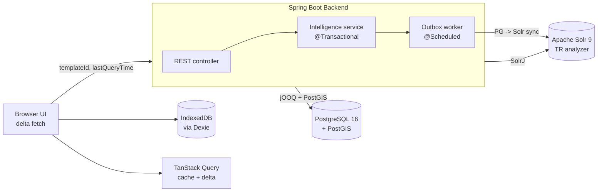

# Intelligence Data Platform — Architecture Design Document

> **MVP**: Spring Boot + PostgreSQL + Solr + PostGIS + Delta Sync

---

## 1. Domain Definition

### 1.1 System Purpose

An enterprise platform for storing intelligence records securely, searching them, and analysing them with simple map-based geographic queries. Users create intelligence records that follow various templates, fetch those records with partition/template-scoped queries and enjoy fast navigation thanks to a client-side local cache. Implementation lives in a new Maven module `osint-intelligence-server` under `D:\osint\osint-intelligence-modules`.

This document defines the **MVP scope**.

### 1.2 Data Characteristics

- **Long-term target**: 20-30 million records (~600,000 per template on average).
- **MVP target**: validation on a small-to-medium dataset (a handful of templates × a few thousand records each); the architecture is built so it can grow toward 30M, but tuning is out of MVP scope.
- **Record shape**: `Attribute`, `AttributeType`, `AttributeTypeValue`, `Intelligence`, `Template`. The `attributeIdToAttributeValueMap` field is stored as JSONB on the `intelligence` table.
- **Geo fields** (fixed): `location` and `relatedLocationList` on `Intelligence`.
- **String fields**: every static `String` field on the four domain classes.

### 1.3 MVP User Scenarios

- **Template-scoped fetch**: the client requests all intelligence for a `templateId`; on later requests it sends `lastQueryTime` to receive **only the changed** records (delta sync).
- **CRUD**: create / update / soft-delete `Intelligence`, `Template`, `Attribute`, `AttributeTypeValue`.
- **Simple geo queries**: points inside a polygon, records within X km of a centre point.
- **Full-text search (Turkish)**: BM25 search via Solr.

### 1.4 Domain Entity Model

The four domain classes live in [`osint-intelligence-model`](d:/osint/osint-intelligence-modules/osint-intelligence-model). On `Intelligence`, the `attributeIdToAttributeValueMap` field stores values for the `Attribute`s referenced from the row's `templateId`. Because `Template.attributeIdList` is dynamic (different templates have different attributes), this map is dynamic too — that is why the column is **JSONB** in Postgres. We must support dynamic queries against it.

#### Example entity set

```
*******************
AttributeTypeValue
*******************
id: femaleId
version: 1
value: "FEMALE"
attributeId: "genderAttributeId"

id: maleId
version: 1
value: "MALE"
attributeId: "genderAttributeId"

id: noneId
version: 1
value: "NONE"
attributeId: "genderAttributeId"

***********
Attribute
***********
id: genderAttributeId
version: 1
name: gender
createdAt: t1
lastModified: t1
attributeType: ENUM
attributeValueTypeIdList: [femaleId, maleId, noneId]

id: weightAttributeId
version: 1
name: weight
createdAt: t1
lastModified: t1
attributeType: NUMBER
attributeValueTypeIdList: []

***********
Template
***********
id: personTemplateId
name: personTemplate
createdAt: t1
lastModified: t1
childTemplateIdList: [childTemplate1Id, childTemplate2Id]
attributeIdList: [genderAttributeId, weightAttributeId]

id: childTemplate1Id
name: childTemplate1
childTemplateIdList: []
attributeIdList: []

id: childTemplate2Id
name: childTemplate2
childTemplateIdList: []
attributeIdList: []

************
Intelligence
************
id: childTemplate1IntelligenceId
version: 1
header: "child template 1 intelligence header"
description: "child template 1 intelligence description"
createdAt: t1
lastModified: t1
keywords: ["kw1", "kw2"]
attachedFileUniqueIdList: ["fileId1"]
location: <JTS Geometry>
relatedLocationList: [<JTS Geometry>]
templateId: childTemplate1Id

id: childTemplate2IntelligenceId
version: 1
header: "child template 2 intelligence header"
templateId: childTemplate2Id
... (same shape)

id: mainIntelligenceId
version: 1
header: "intelligence header"
description: "intelligence description"
createdAt: t1
lastModified: t1
keywords: ["kw1", "kw2"]
attachedFileUniqueIdList: ["fileId1"]
location: <JTS Geometry>
relatedLocationList: [<JTS Geometry>]
templateId: personTemplateId
relatedIntelligenceIdList: [childTemplate1IntelligenceId, childTemplate2IntelligenceId]
attributeIdToAttributeValueMap: {
  "genderAttributeId": "femaleId",
  "weightAttributeId": 25
}
```

This dataset shows the values held by the **pure Java** domain beans.

#### Postgres mapping

- Primitive fields (`String`, `long`, `boolean`, `Instant`) map to their natural SQL types.
- Lists of primitive ids map to `TEXT[]` arrays.
- `Geometry` and `List<Geometry>` map to PostGIS `GEOMETRY(Geometry, 4326)` and `GEOMETRY[]`.
- `Intelligence.attributeIdToAttributeValueMap` maps to a single JSONB column named **`attribute_values`**.

#### Java memory vs Postgres JSONB vs Solr — single rule

| Layer | Key | Value (when `AttributeType` is enum) | Value (otherwise) |
|-------|-----|--------------------------------------|-------------------|
| Java domain (`Map<String,Object>`) | `Attribute.id` | `AttributeTypeValue.id` | raw scalar |
| Postgres `attribute_values` JSONB | `Attribute.name` | `AttributeTypeValue.value` | raw scalar |
| Solr dynamic field | `Attribute.name + suffix` | `AttributeTypeValue.value` | raw scalar |

The outbox worker performs the `id -> name` translation when writing JSONB / Solr and is the only place the lookup runs.

#### Solr document mapping

[managed-schema.xml](d:/osint/osint-intelligence-modules/osint-intelligence-solr-server/src/main/resources/conf/managed-schema.xml) already declares static fields under `<!-- Intelligence static fields -->` and dynamic field suffixes under `<!-- Intelligence dynamic fields -->`.

Dynamic field suffix per `AttributeType` (matching the existing schema):

| AttributeType | Solr suffix | Solr field type |
|---------------|-------------|-----------------|
| `STRING` | `_s` | string |
| `ENUM` | `_s` | string (stores `AttributeTypeValue.value`) |
| `NUMBER` | `_l` | plong |
| `BOOLEAN` | `_b` | boolean |
| `DATE` | `_dt` | pdate |
| `GEOMETRY` | `_srpt` | location_rpt |
| `ENUM_LIST` | `_ss` | strings (multi-valued) |
| `DATE_LIST` | `_dts` | pdates |
| `GEOMETRY_LIST` | `_srpt` | location_rpt (multi-valued) |

#### JSONB query examples (jOOQ)

```java
// Filter by a specific attribute value (name-based, matches JSONB shape):
dsl.selectFrom(INTELLIGENCE)
   .where(INTELLIGENCE.TEMPLATE_ID.eq(templateId))
   .and(DSL.condition("attribute_values ->> {0} = {1}",
                      DSL.val("gender"), DSL.val("FEMALE")))
   .fetch();
// JSONB GIN index keeps this in milliseconds.
```

#### Outbox worker JSONB -> Solr conversion

For every dirty `Intelligence` row the worker:

1. Reads the row from Postgres (JSONB included).
2. Uses cached `Attribute` and `AttributeTypeValue` rows to translate `attributeId -> attributeName` and (for enums) `AttributeTypeValue.id -> AttributeTypeValue.value`.
3. Maps the translated entries to Solr dynamic fields using the suffix table above.
4. Computes `location` centroid into the Solr `location_rpt` field.
5. Sends `add`/`delete` via SolrJ; commits in batches.

### 1.5 Technical Constraints

- **ACID**: transactional consistency is required for writes.
- **Self-hosted**: every component runs on-prem.

---

## 2. Architectural Challenges (MVP)

### 2.1 No single store covers every need

| Need | Solr alone | PostgreSQL alone |
|------|-----------|------------------|
| ACID transaction | No | Yes |
| Complex geo queries | Limited | Yes (PostGIS) |
| Full-text + faceting | Yes | Adequate but weaker |
| Audit / compliance | Weak | Yes |

### 2.2 Cross-store consistency

When the same data lives in two stores, a write that succeeds in one and fails in the other creates inconsistency. Resolution: **Transactional Outbox Pattern** — the write commits to Postgres and an `intelligence_outbox` row in the same transaction, an async worker propagates to Solr.

### 2.3 Eventual consistency window

A row written to Postgres becomes visible in Solr only after the outbox worker runs (sub-second under normal load). The client can show its own write immediately (optimistic UI); the backend reconciles in the background.

### 2.4 Combined Search: geo + full-text + dynamic attributes in one request

Users want to combine a polygon drawn on the map, a free-text query and dynamic attribute filters in a single search. These three filters live in different stores: geo -> PostGIS, text + dynamic attr -> Solr. No single store solves it.

**Solution: backend orchestration (parallel queries + id intersection)**

The backend issues both queries in parallel: Solr returns id+score; PostGIS returns id set. The backend intersects the two id sets and hydrates the rows from Postgres. Polygon usually shrinks the PG side dramatically, so the intersection is cheap.

### 2.5 Delta sync and delete detection

The "what changed?" question is answered with `lastModified > lastQueryTime`: the client records the highest `lastModified` it has seen; the next call sends it as `lastQueryTime`. Plain delta does **not** report deletions, so we use **soft delete** — rows are flagged `deleted = true`, `deletedAt`/`deletedBy` are set, and `lastModified` is bumped so the delta sync still surfaces them.

---

## 3. Final Solution: Polyglot Persistence (MVP)

### 3.1 Architecture summary

```
PostgreSQL + PostGIS  ->  source of truth, geo, CRUD
Solr 9.x (latest)     ->  Turkish full-text, faceted search
Spring Boot backend   ->  orchestration, outbox sync
```

### 3.2 Why each piece

**PostgreSQL + PostGIS — source of truth**

- ACID transaction so entity + geometry + outbox commit atomically.
- PostGIS is the industry-standard spatial extension (`ST_Contains`, `ST_DWithin`, ...).
- Disaster recovery: even if Solr is corrupted, a full reindex is always possible.

**Solr 9.x — full-text**

- Strong Turkish analyser (Zemberek integration).
- BM25 ranking, highlighting, faceting.
- Already present in the platform; we adopt the latest version.

**Spring Boot backend — thin orchestration**

- Single integration surface; both PG and Solr are reached from here.
- Outbox worker runs in the same JVM via `@Scheduled`.
- **jOOQ as the only data access layer** (CRUD, geo, delta sync, outbox — all type-safe DSL; no JPA/Hibernate, see K-7).
- SolrJ + jOOQ + Spring ecosystem.

### 3.3 Strengths and weaknesses

**PostgreSQL + PostGIS**

- Strong: ACID, PostGIS, backup/PITR.
- Weak: not at Solr's level for full-text; no native faceted search.

**Apache Solr 9**

- Strong: Lucene inverted index, Turkish analyser, BM25, faceting, scales past 30M.
- Weak: no ACID, weak complex geo, schema evolution may need a reindex.

**Spring Boot + jOOQ**

- Strong: compile-time type safety, no ORM magic, PG-first, `@Async`/`@Scheduled`, SolrJ.
- Weak: JVM cold start; one-time jOOQ codegen setup (~1 hour).

---

## 4. Final Decisions (MVP)

### K-1: Source of Truth = PostgreSQL

**All authoritative writes go to PostgreSQL.** ACID and disaster recovery are non-negotiable; if Solr is corrupted we can always reindex from PG.

### K-2: Geo data lives in PostGIS

**Authoritative geometry is in PostGIS; only a centroid (lat/lon) is indexed in Solr.** Simple spatial queries (inside polygon, within distance) go to PostGIS.

### K-3: Synchronisation = Transactional Outbox Pattern

**PG -> Solr sync runs through the `intelligence_outbox` table with eventual consistency.** A write succeeds even when Solr is down; the worker retries Solr. At-least-once delivery is guaranteed; the worker is idempotent.

### K-4: Full-text Search = Solr

**Turkish full-text and faceted search run in Solr.** Zemberek stemming, BM25 ranking — Solr's strong suit.

### K-5: Delete strategy = Soft delete

**Rows are never physically deleted.** `deleted = true`, `deletedAt`, `deletedBy` are set, and `lastModified` is bumped. Delta sync surfaces deleted rows so the client can tombstone them.

### K-6: Delta sync protocol = `lastQueryTime`

**Clients send `templateId` plus an optional `lastQueryTime` on every request.** Without `lastQueryTime` we return a full snapshot (excluding deleted rows). With it we return rows where `lastModified > lastQueryTime`, including soft-deleted ones.

### K-7: Data access layer = jOOQ (one tool, everywhere)

**All PostgreSQL access — CRUD, geo, delta sync, outbox, export — flows through jOOQ `DSLContext`; we do not use JPA/Hibernate.** jOOQ generates Java types from the live PG schema (codegen); a column rename or type change becomes a compile-time error rather than a runtime surprise. PostGIS functions (`ST_Contains`, `ST_DWithin`, ...) are wrapped in a small type-safe helper. At 30M rows the cost of a one-hour codegen setup is paid back many times by catching schema drift early.

---

## 5. Query Routing Matrix (MVP)

| # | Query type | Target system | Data access | Notes |
|---|-----------|---------------|-------------|-------|
| 1 | Entity by id | PostgreSQL | jOOQ `dsl.selectFrom(INTELLIGENCE).where(...ID.eq(id))` | PK lookup |
| 2 | Template-scoped list | PostgreSQL | jOOQ + `fetchSize(1000) + fetchStreamInto` | streaming cursor |
| 3 | Template-scoped filtered | PostgreSQL | jOOQ dynamic `condition.and(...)` | null-safe WHERE |
| 4 | Inside polygon (`ST_Contains`) | PG + PostGIS | jOOQ + `PostGIS.stContains(...)` | GiST index |
| 5 | Distance (`ST_DWithin`) | PG + PostGIS | jOOQ + `PostGIS.stDWithin(...)` | GiST index |
| 6 | Turkish full-text (template-scoped) | Solr | SolrJ | BM25, Zemberek |
| 7 | Cross-template full-text | Solr | SolrJ | whole collection |
| 8 | Faceted search | Solr | SolrJ | native faceting |
| 9 | Fuzzy search | Solr | SolrJ | edit distance |
| 10 | Delta sync | PostgreSQL | jOOQ streaming | `lastModified > ?`, soft-deleted included |
| 11 | Entity CRUD | PG (+ outbox) | jOOQ | ACID, `@Transactional`, `version` |
| 12 | Export (CSV) | PostgreSQL | jOOQ streaming cursor | constant memory |
| 13 | Outbox worker sync | PG -> Solr | jOOQ `batch` + SolrJ | batch, predictable |
| 14 | Combined search (geo + text + dyn-attr) | Solr + PostGIS parallel -> backend intersection -> PG hydrate | SolrJ + jOOQ + `CompletableFuture` | section 6.3 |

---

## 6. Data Flow Summary

### 6.1 Write flow

```
Browser (templateId + header + description + attributes{name:value})
  -> Spring controller
  -> IntelligenceService (@Transactional)
      -> INSERT/UPDATE intelligence (attribute_values JSONB)
      -> INSERT intelligence_outbox (entity_id, op: INSERT|UPDATE|DELETE)
      -> [commit]
  -> 202 Accepted

[Async]
OutboxWorker (@Scheduled, 1s)
  -> read unprocessed outbox rows in batch (FOR UPDATE SKIP LOCKED)
  -> for each row:
      -> reload Intelligence row from Postgres (attribute_values JSONB included)
      -> use cached Attribute / AttributeTypeValue rows to translate
         id -> name and (for ENUM/ENUM_LIST) value-id -> value
      -> map translated entries to Solr dynamic fields:
         STRING/ENUM -> _s, NUMBER -> _l, BOOLEAN -> _b, DATE -> _dt,
         GEOMETRY -> _srpt, ENUM_LIST -> _ss, DATE_LIST -> _dts,
         GEOMETRY_LIST -> _srpt
      -> compute location centroid -> Solr location_rpt
      -> SolrJ add/delete
  -> Solr commit (batch)
  -> mark outbox.processed_at = now()
```

### 6.2 Delta sync read flow

```
GET /api/intelligence?templateId=X[&lastQueryTime=Y]
  -> Spring controller
  -> IntelligenceService
      -> jOOQ stream:
         - if Y absent: rows where deleted = false
         - if Y present: rows where last_modified > Y (deleted included)
      -> response { records: [...], serverTime: ISO-8601 }
```

### 6.3 Combined search flow (geo + text + dyn-attr)

```
Browser (polygon WKT + q="..." + filters={source:"OSINT", date>"2024-01-01"})
  -> POST /api/intelligence/combined-search
  -> CombinedSearchService
      -> CompletableFuture.allOf(
          Solr query (q, fq=templateId:X, fq=source_s:OSINT, fq=date_dt:[2024-01-01 TO *],
                      fl=id,score, rows=5000) -> Map<id, score>,
          PostGIS query (template_id = X AND ST_Contains(polygon, geom)) -> Set<id>
         )
      -> matchedIds = solrIds ∩ geoIds
      -> hydrate rows from Postgres WHERE id IN (matchedIds)
      -> sort by Solr score
      -> response { records: [...], total: N }
```

#### Edge cases

| Situation | Behaviour |
|-----------|-----------|
| Polygon missing, only text/attr | Solr only; geo step skipped |
| Text/attr missing, only polygon | PostGIS only (`ST_Contains`); Solr step skipped |
| Solr returns 0 hits | Intersection empty; no PG hydration |
| Solr returns 5000 hits (cap) | Add response header `X-Result-Capped: true` |
| Both supplied | Parallel query + intersection |

---

## 7. Technology Stack and Setup Requirements

### 7.1 Backend stack (Spring Boot)

**Working environment**

| Component | Version | Notes |
|-----------|---------|-------|
| Java | 21 | osint-tools JDK at `D:\osint\osint-tools\.tools\jdk` |
| Maven | 3.9.x | osint-tools Maven |
| Spring Boot | 3.4.5 | matches `osint-auth-backend` |
| jOOQ | 3.19.x | bundled by `spring-boot-starter-jooq` |
| SolrJ | 9.10.x | matches Solr server version |
| PostgreSQL | 16 | Docker image `postgis/postgis:16-3.4` |
| PostGIS | 3.4 | extension `CREATE EXTENSION postgis` |

**Spring Boot starters**

- `spring-boot-starter-web` — REST API (Spring MVC).
- `spring-boot-starter-jooq` — `DSLContext` bean + Spring transaction integration; **JPA/Hibernate is not used**.
- `spring-boot-starter-validation` — DTO validation (`jakarta.validation`).
- `spring-boot-starter-actuator` — health/info.

**Data access libraries**

- `org.postgresql:postgresql` — PostgreSQL JDBC driver.
- `org.jooq:jooq` (transitive via starter).
- `org.locationtech.jts:jts-core` — `Geometry`, `Point`, `Polygon`, WKT/WKB parse.
- `net.postgis:postgis-jdbc` — PostGIS geometry binding for JDBC.
- `org.apache.solr:solr-solrj` — SolrJ client (Solr 9.x).
- `org.flywaydb:flyway-core` — schema migrations.

**Custom code (one-off)**

- `com.osint.intelligence.db.binding.JtsGeometryBinding` — jOOQ `Binding<Geometry, ?>` mapping `geometry` columns to JTS via WKT.
- `com.osint.intelligence.db.PostGIS` — type-safe wrappers for `ST_Contains`, `ST_DWithin`, `ST_Intersects`, `ST_MakePoint`.

**jOOQ codegen (K-7)**

A Maven profile (`-Pjooq-codegen`) configures `jooq-codegen-maven` to read the live PG schema and generate Java types under `com.osint.intelligence.db.generated`. The profile is opt-in so the build succeeds without a database (default profile uses string-based DSL).

**Audit fields (jOOQ explicit, no magic)**

```java
private Map<Field<?>, Object> auditCreate(String user, OffsetDateTime now) {
    return Map.of(
        INTELLIGENCE.CREATED_AT,   now,
        INTELLIGENCE.CREATED_BY,   user,
        INTELLIGENCE.LAST_MODIFIED, now,
        INTELLIGENCE.MODIFIED_BY,  user,
        INTELLIGENCE.VERSION,      0L
    );
}
```

**Optimistic locking**

`INTELLIGENCE.VERSION` is bumped on every update with a `WHERE version = expected` clause; if the affected-row count is zero we throw `OptimisticLockException`.

**JSON / serialisation**

- `com.fasterxml.jackson.core:jackson-databind` (transitive via Spring Boot).
- `com.fasterxml.jackson.datatype:jackson-datatype-jsr310` for `Instant` / `OffsetDateTime`.

**Tests**

- `spring-boot-starter-test` (JUnit 5, Mockito, AssertJ).
- `org.testcontainers:postgresql` (PostGIS image).
- `org.testcontainers:solr`.

**Logging**: Logback via SLF4J (Spring Boot default).

### 7.2 Database and search systems

| Component | Version | Notes |
|-----------|---------|-------|
| PostgreSQL | 16.x | Docker image `postgis/postgis:16-3.4` (PostGIS bundled) |
| PostGIS | 3.4.x | extension on Postgres (`CREATE EXTENSION postgis`) |
| Apache Solr | same version as `osint-intelligence-solr-server` | Docker image `solr:9.x` |

**PostgreSQL extensions**

- `postgis` — geometry types and functions.
- `uuid-ossp` — `uuid_generate_v4()`.

**Solr configuration**

- The Solr core is configured by [osint-intelligence-solr-server](d:/osint/osint-intelligence-modules/osint-intelligence-solr-server) — its `conf/` directory and `core.properties` are reused as-is.

**Docker services (MVP)**

- `postgres` — `postgis/postgis:16-3.4`, port 5432, persistent volume; started ad-hoc (no docker-compose).
- `solr` — managed by `osint-intelligence-solr-server`; the user keeps it running. The intelligence server **does not** start or configure Solr.

### 7.3 API endpoint summary (MVP)

| Method | Path | Backend | Description |
|--------|------|---------|-------------|
| `GET` | `/api/intelligence?templateId=X&lastQueryTime=Y` | PostgreSQL (jOOQ streaming) | delta sync — full snapshot if `Y` absent, otherwise `last_modified > Y` |
| `GET` | `/api/intelligence/{id}` | PostgreSQL (jOOQ) | by id |
| `POST` | `/api/intelligence` | PostgreSQL + outbox -> Solr | create |
| `PUT` | `/api/intelligence/{id}` | PostgreSQL + outbox -> Solr | update |
| `DELETE` | `/api/intelligence/{id}` | PostgreSQL + outbox -> Solr | soft delete |
| `GET` | `/api/intelligence/search?q=...&template=...` | Solr (SolrJ) | full-text |
| `GET` | `/api/intelligence/search/facets?template=...` | Solr | faceted aggregation |
| `POST` | `/api/intelligence/combined-search` | Solr + PostGIS parallel -> id intersection -> PG | section 6.3 |
| `POST` | `/api/intelligence/within-polygon` | PG + PostGIS (jOOQ) | `ST_Contains`, body=WKT |
| `GET` | `/api/intelligence/near?lat=..&lon=..&km=..` | PG + PostGIS (jOOQ) | `ST_DWithin` |
| `GET` | `/api/templates` | PostgreSQL | list all templates |
| `GET` | `/api/templates/{id}/attributes` | PostgreSQL | attributes for a template |
| `GET` | `/actuator/health` | actuator | PG + Solr health |

### 7.4 PostgreSQL index strategy

jOOQ is a thin layer; query performance comes from PG indexes. Every read filters on `template_id`, plus geo / delta / search hot paths.

#### `intelligence` table indexes

```sql
-- 1. GiST: heart of every geo query (ST_Contains, ST_DWithin, ST_Intersects).
--    Without it spatial queries do a full table scan — unacceptable at 30M.
CREATE INDEX idx_intelligence_geom
    ON intelligence USING GIST (location);

-- 2. Composite GiST: template + geom for template-scoped geo queries.
CREATE INDEX idx_intelligence_template_geom
    ON intelligence USING GIST (template_id, location);

-- 3. BRIN: heart of delta sync (last_modified > ?).
--    Append-dominant table -> BRIN is much smaller than B-tree, plenty fast.
CREATE INDEX idx_intelligence_last_modified_brin
    ON intelligence USING BRIN (last_modified) WITH (pages_per_range = 128);

-- 4. (template_id, last_modified): delta sync + template filter combined.
CREATE INDEX idx_intelligence_template_last_modified
    ON intelligence (template_id, last_modified);

-- 5. Partial index over active rows (deleted = false).
CREATE INDEX idx_intelligence_active
    ON intelligence (template_id, last_modified)
    WHERE deleted = false;

-- 6. JSONB GIN: dynamic attribute filters such as
--    `attribute_values ->> 'gender' = 'FEMALE'`.
CREATE INDEX idx_intelligence_attribute_values_gin
    ON intelligence USING GIN (attribute_values);
```

#### `intelligence_outbox` table indexes

```sql
-- 7. Partial index on unprocessed rows: workers only scan pending work.
CREATE INDEX idx_intelligence_outbox_unprocessed
    ON intelligence_outbox (created_at)
    WHERE processed_at IS NULL;
```

#### Index selection rationale

| Index | Type | Reason |
|-------|------|--------|
| `location` | GiST | required by `ST_Contains` / `ST_DWithin` |
| `(template_id, location)` | GiST composite | template-scoped geo in one index |
| `last_modified` | BRIN | delta sync on append-dominant table |
| `(template_id, last_modified)` | B-tree | delta sync + template filter |
| `(template_id, last_modified) WHERE deleted = false` | partial B-tree | active reads, half the size |
| `attribute_values` | GIN | dynamic JSONB filters |
| `intelligence_outbox.created_at WHERE processed_at IS NULL` | partial B-tree | worker-only reads |

#### PG parameter recommendations (dev minimum)

```
work_mem = 64MB
shared_buffers = 512MB
effective_cache_size = 2GB
random_page_cost = 1.1   # SSD; use 4.0 for HDD
```

---

## 8. Implementation Phase Plan (MVP)

### Phase 0: Preparation and infrastructure

- Docker: PostgreSQL 16 + PostGIS 3.4. Solr 9.x is provided by `osint-intelligence-solr-server` (already exists).
- Spring Boot 3.4.5 + Java 21 module skeleton at `osint-intelligence-modules/osint-intelligence-server`.
- CORS open for MVP.
- Logback default config.

### Phase 1: Domain data model + CRUD

- Reuse the four classes from [`osint-intelligence-model`](d:/osint/osint-intelligence-modules/osint-intelligence-model). Add audit + soft-delete fields (`createdAt`, `createdBy`, `lastModified`, `modifiedBy`, `version` (already present), `deleted`, `deletedAt`, `deletedBy`).
- Flyway migrations: `V1__schema.sql` (tables + PostGIS extension), `V2__indexes.sql` (section 7.4), `V3__outbox.sql` (outbox table).
- jOOQ codegen Maven profile + `JtsGeometryBinding`. Default profile uses string-based DSL so the build does not require a live DB.
- DTOs per entity (`IntelligenceDto`, `TemplateDto`, `AttributeDto`, `AttributeTypeValueDto`); the shared mutable beans are not used directly in jOOQ projections.
- `IntelligenceRepository`, `TemplateRepository`, `AttributeRepository`, `AttributeTypeValueRepository` — each provides CRUD via jOOQ (`insertInto`, `selectFrom`, `update`, soft-delete update).
- Audit fields are set explicitly on every operation.
- REST endpoints (`POST /api/intelligence`, `PUT`, `DELETE`, `GET /{id}`, plus equivalents for templates and attributes) with a thin service layer.
- Unit + integration tests with Testcontainers PostGIS.

### Phase 2: Outbox sync + geo queries

- `intelligence_outbox` table + unprocessed partial index.
- `OutboxWorker` (`@Scheduled`): batch read with `SELECT ... FOR UPDATE SKIP LOCKED`, SolrJ add/delete, retry + backoff.
- SolrJ client `@Bean`.
- `PostGIS` helper class (`stContains`, `stDWithin`, `stMakePoint`).
- `GeoQueryRepository` exposing `withinPolygon(geometry, templateId)` and `near(lat, lon, km, templateId)`.
- Endpoints: `POST /api/intelligence/within-polygon`, `GET /api/intelligence/near`.
- Solr full-text endpoint: `GET /api/intelligence/search`.
- `CombinedSearchService`: `CompletableFuture.allOf` of Solr + PostGIS, intersect, hydrate, sort by score; edge cases per section 6.3.
- `POST /api/intelligence/combined-search`.
- Basic outbox-lag metric.

### Phase 3: Delta sync + client cache

- `DeltaSyncRepository`:
  - `dsl.selectFrom(INTELLIGENCE).where(conditions).orderBy(LAST_MODIFIED, ID).fetchSize(1000).fetchStreamInto(IntelligenceDto.class)`.
  - `@Transactional(readOnly=true)` + server-side cursor.
  - dynamic `conditions`: when `lastQueryTime` is null filter by `deleted = false`; otherwise `last_modified > lastQueryTime` (deleted included).
- `GET /api/intelligence?templateId=X&lastQueryTime=Y` returns `{ records, serverTime }`.
- Pagination: tuple cursor `row(LAST_MODIFIED, ID).gt(row(ts, id))`.

---

## 9. Architecture diagram (MVP)


