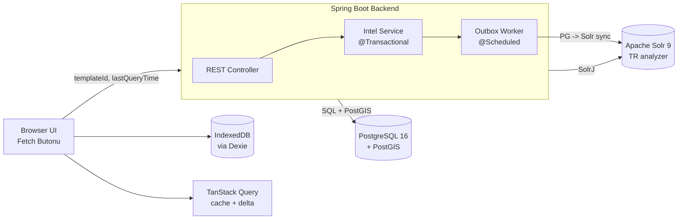

# İstihbarat Veri Platformu — Mimari Tasarım Dokümanı

> **MVP**: Spring Boot + PostgreSQL + Solr + PostGIS + Delta Sync

---

## 1. Domain Tanımı

### 1.1 Sistem Amacı

İstihbarat verilerinin dijital ortamda güvenli şekilde saklanması, aranması ve harita tabanlı basit coğrafi sorgularla analiz edilmesi için kurumsal düzey bir platform. Kullanıcılar çeşitli şablonlarda istihbarat kayıtları oluşturur, bu kayıtları partition/template bazlı sorgularla çeker ve client tarafında local cache ile hızlı gezinme deneyimi yaşar.Bu kapsamda D:\osint\osint-intelligence-modules altında osint-intelligence-server adında maven modülü yaratılacak ve  implementasyon bu modüle yapılacaktır

Bu doküman **MVP kapsamını** tanımlar

### 1.2 Veri Karakteristiği

- **Uzun vadeli hedef**: 20-30 milyon kayıt (şablon başına ~600.000 ortalama)
- **MVP hedefi**: Küçük-orta ölçekli dataset ile doğrulama (birkaç şablon × birkaç bin kayıt); mimari 30M'e doğru büyümeyi destekleyecek şekilde kurulur ama tuning MVP dışı
- **Kayıt yapısı**: Atrtribute,AttributeType,AttributeTypeValue,Intelligence,Template (attributeIdToAttributeValueMap alannındaki değerler Intelligence tablosunda JSONB olarak tanımlanacak)
- **Geo tipler**:  Intelligence entitysinde location ve relatedLocationList(fix alanlar)
- String tipler: 4 model objesindeki tüm string static alanlar

### 1.3 MVP Kullanıcı Senaryoları

- **Şablon bazlı veri çekme**: Kullanıcı templateId bazlı sorgu atıp tüm istihbaratları ister, sonraki isteklerde `lastQueryTime` parametresi ile **sadece değişen** kayıtlar gelir (delta sync)
- **CRUD**: Intelligence/Template/Attribute/AttributeTypeValue kaydı ekle/güncelle/sil (soft delete)
- **Basit geo sorgular**: Poligon içindeki noktalar, bir merkezden X km içindeki kayıtlar
- **Full-text arama (Türkçe)**: Solr üzerinden BM25 ile arama

### 1.4 Domain Entity Modeli

D:\osint\osint-intelligence-modules\osint-intelligence-model modülünde tüm intelligence domain modelleri yer almaktadır.Intelligence modelindeki attributeIdToAttributeValueMap alanında mevcut intelligence entitysindeki templateId ile referans verilen Attribute entitylerine atanan değerler yer almaktadır.Template entitylerinin attributeIdList sayısı yani Attribute sayısı dinamik olduğu için attributeIdToAttributeValueMap alanındaki attribute ve değerleri de dinamiktir.Bu yüzden attributeIdToAttributeValueMap  alanı Postgresde JSONB olmalıdır.Bu alanlarda aşağıdaki gibi dinamik sorgular atabilmeliyim

Örnek Bir Entity Seti : 

```
*******************
AttributeTypeValue
******************

id:femaleId
version:1
value:"FEMALE"
attributeId:"genderAttributeId"

id:maleId
version:1
value:"MALE"
attributeId:"genderAttributeId"

id:noneId
version:1
value:"NONE"
attributeId:"genderAttributeId"

**********
Attribute
**********
id:genderAttributeId
version:1
name:gender
creationDate:d1,
lastModificationDate:d1
attributeType:ENUM
attributeValueTypeIdList:[femaleId,maleId,noneId]

id:weightAttributeId
version:1
name:weight
creationDate:d1,
lastModificationDate:d1
attributeType:NUMBER
attributeValueTypeIdList:[]

********
Template
*********
id:personTemplateId
name:personTemplate
creationDate:d1,
lastModificationDate:d1
childTemplateIdList:[childTemplate1Id,childTemplate2Id]
attributeIdList:[genderAttributeId,weightAttributeId]

id:childTemplate1Id
name:childTemplate1
creationDate:d1,
lastModificationDate:d1
childTemplateIdList:[]
attributeIdList:[]

id:childTemplate2Id
name:childTemplate2
creationDate:d1,
lastModificationDate:d1
childTemplateIdList:[]
attributeIdList:[]

************
Intelligence
************

id:childTemplate1IntelligenceId
version:1
header:"child template 1 intelligence header"
description:"child template 1 intelligence description"
creationDate:d1,
lastModificationDate:d1
keywords:["kw1","kw2"]
attachedFileUniqueIdList:['fileId1']
location:geometry JTS
relatedLocationList :geometry JTS list
templateId:childTemplate1Id

id:childTemplate2IntelligenceId
version:1
header:"child template 2 intelligence header"
description:"child template 2 intelligence description"
creationDate:d1,
lastModificationDate:d1
keywords:["kw1","kw2"]
attachedFileUniqueIdList:['fileId1']
location:geometry JTS
relatedLocationList :geometry JTS list
templateId:childTemplate2Id

id:mainIntelligenceId 
version:1
header:"intelligence header"   
description:"intelligence description"
creationDate:d1,
lastModificationDate:d1
keywords:["kw1","kw2"]
attachedFileUniqueIdList:['fileId1']
location:geometry JTS
relatedLocationList :geometry JTS list
templateId:personTemplateId
relatedIntelligenceIdList:[childTemplate1IntelligenceId,childTemplate2IntelligenceId]
attributeIdToAttributeValueMap:{{key :'genderAttributeId', value:femaleId},{key :'weightAttributeId', value:25}}


Bu veri seti pure java model içindeki değerleri temsil ediyor

POSTGRES karşılıkları
*********************
Bu entitylerdeki pirimitive alanlar POSTGRES tablolarında varsayılan tipleriyle kaydedilecektir(string,long vs..)
Ama Intelligence entitysindeki attributeIdToAttributeValueMap alanı JSONB olarak tanımlanmalıdır

Solr Document Karşılıkları
*************************

D:\osint\osint-intelligence-modules\osint-intelligence-solr-server\src\main\resources\conf\managed-schema.xml dosyasında
<!-- Intelligence static fields-->  alanlar tanımlandı

attributeIdToAttributeValueMap  alanları da   <!-- Intelligence dynamic fields--> kısmında tanımlandı

Her nekadar Intelligence modelinde attributeIdToAttributeValueMap alanı  memory de attributeId mapi tutsa da hem solr da hem postresde jsonb içinde bu attribute lerin name alanı tutulacak(Join sorgusundan kurtulmak için)


```

---

**JSONB Sorgu Örnekleri (jOOQ üzerinden):**

```java
// Belirli bir attribute değerine göre filtre
dsl.selectFrom(INTELLIGENCE)
   .where(INTELLIGENCE.TEMPLATE_ID.eq(templateId))
   .and(DSL.condition("attributeIdToAttributeValueMap ->>'gender' = {0}", DSL.val("FEMALE")))
   .fetch();

// JSONB GIN index → bu sorgu milisaniyeler içinde döner
```

#### PG → Solr Dönüşümü (Outbox Worker)

Worker, her Intelligence kaydını Solr'a gönderirken JSONB attributes'u Attribute tablosundaki `type` bilgisine bakarak dynamic field'lara dönüştürür:

### 1.5 Teknik Kısıtlar

- **ACID**: Veri tutarlılığı için transaction zorunlu
- **Self-hosted**: Tüm bileşenler on-prem çalışır

---

## 2. Mimari Zorluklar (MVP)

### 2.1 Tek Teknolojinin Yetersizliği

Hiçbir tek sistem tüm ihtiyaçları optimum karşılayamaz:


| İhtiyaç                    | Solr tek başına | PostgreSQL tek başına |
| -------------------------- | --------------- | --------------------- |
| ACID transaction           | Hayır           | Evet                  |
| Karmaşık geo operasyonları | Sınırlı         | Evet (PostGIS)        |
| full-text + faceting       | Evet            | Yeterli ama zayıf     |
| Audit/compliance           | Zayıf           | Evet                  |


### 2.2 Veri Tutarlılığı (Senkronizasyon) Problemi

Birden fazla sistem kullandığımızda aynı veri birden fazla yerde tutulur. Yazma bir sistemde başarılı olup diğerinde fail ederse **inconsistency** oluşur. Çözüm: **Transactional Outbox Pattern**. Yazma PG'ye + outbox tablosuna aynı transaction'da düşer; async worker Solr'a aktarır.

### 2.3 Eventual Consistency Penceresi

PG'ye yazılan verinin Solr'da görünmesi anında olmaz — outbox worker çalışana kadar gecikme (normal koşullarda saniyeden az) vardır. Client yazdığı veriyi anında gösterir (optimistic UI), backend arka planda senkronize eder.

### 2.4 Combined Search: Geo + Full-text + Dinamik Attribute Tek Sorguda

Kullanıcı aynı anda haritadan çizdiği poligonu, free-text sorguyu ve dinamik attribute filtrelerini birleştirerek tek bir arama yapabilmelidir. Ancak bu üç filtre farklı sistemlerde işlenir: geo → PostGIS, text+dynamic attr → Solr. Tek sistemle çözülemez.

**Çözüm: Backend orkestrasyon (paralel sorgu + id kesişimi)**

Backend iki sorguyu paralel çalıştırır: Solr text+dynamic attr sonucu → id kümesi; PostGIS geo sorgusu → id kümesi. İki kümenin kesişimi frontend'e döner. Poligon genellikle PG sonucunu dramatik biçimde küçülttüğü için kesişim maliyeti yönetilebilir düzeydedir.

### 2.5 Delta Sync ve Silme Tespiti

Client istek atarken "hangi kayıt değişti" sorusu `lastModified > lastQueryTime` ile çözülür.Yani ilk sorguda template bazlı istek atar ve dönen intelligence ların en güncel olanının last modified alanını kaydeder ve bir sonraki sorguya `lastModified > lastQueryTime ekler.`  Ama **silinen kayıtlar** bu filter'la yakalanmaz. Çözüm: **soft delete pattern** — kayıt silinmez, `deleted=true` ile işaretlenir ve `lastModified` güncellenir

---

## 3. Nihai Çözüm: Polyglot Persistence (MVP)

### 3.1 Mimari Özet

```
PostgreSQL + PostGIS  →  Source of truth, geo, CRUD
Solr 9.x (son sürüm)  →  Türkçe full-text, faceted search
Spring Boot Backend   →  Orkestrasyon, outbox sync
```

### 3.2 Seçim Gerekçeleri

**PostgreSQL + PostGIS — source of truth:**

- ACID transaction; entity + geometry + outbox atomik
- PostGIS: sektör standardı geo desteği, `ST_Contains`/`ST_DWithin` vb.
- Disaster recovery: Solr corrupt olsa bile reindex her zaman mümkün

**Solr 9.x — full-text:**

- Gelişmiş Türkçe analyzer (Zemberek entegrasyonu)
- BM25 relevance, highlighting, faceting
- Mevcut sistemde zaten kullanılıyor; son sürüme geçilerek yeni mimaride temel

**Spring Boot Backend — ince orkestrasyon:**

- Tek orkestrasyon noktası; PG ve Solr'a erişim buradan
- Outbox worker aynı JVM'de `@Scheduled` ile çalışır
- **jOOQ tek veri erişim katmanı**: CRUD, geo, delta sync, outbox — hepsi tip güvenli DSL; JPA/Hibernate yok (K-9)
- SolrJ + jOOQ + Spring ekosistemi

### 3.3 Güçlü ve Zayıf Yönler

**PostgreSQL + PostGIS**

- Güçlü: ACID, PostGIS geo, backup/PITR
- Zayıf: Full-text Solr seviyesinde değil, faceted search yok

**Apache Solr 9**

- Güçlü: Lucene inverted index, Türkçe analyzer, BM25, faceting, 30M+ ölçek
- Zayıf: ACID yok, karmaşık geo zayıf, schema evolution reindex gerektirir

**Spring Boot + jOOQ**

- Güçlü: jOOQ compile-time tip güvenliği, sıfır ORM magic, PG-first, `@Async`/`@Scheduled`, SolrJ ekosistemi
- Zayıf: JVM soğuk start; jOOQ codegen için ilk kurulum ~1 saat

---

## 4. Net Karar Metinleri (MVP)

### K-1: Source of Truth = PostgreSQL

**Tüm yazma işlemlerinin authoritative kaynağı PostgreSQL'dir.** ACID garantisi ve disaster recovery için non-negotiable; Solr corrupt olsa bile PG'den reindex her zaman mümkün.

### K-2: Geo Verisi PostGIS'te

**Authoritative geometri PostGIS'te tutulur; Solr'da sadece centroid (lat/lon) indexlenir.** Basit spatial sorgular (poligon içinde, mesafe) PostGIS'e yönlendirilir.

### K-3: Senkronizasyon = Transactional Outbox Pattern

**PG → Solr senkronizasyonu outbox tablosu üzerinden eventual consistency ile yapılır.** Solr down olsa bile yazma başarılı olur, worker retry ile Solr'ı günceller — at-least-once garanti.

### K-4: Full-text Search = Solr

**Türkçe full-text arama, faceted search Solr'da çalışır.** Zemberek stemming, BM25 ranking Solr'ın güç alanı.

### K-7: Silme Stratejisi = Soft Delete

**Kayıtlar fiziksel silinmez; `deleted=true` + `deletedAt` + `deletedBy` ile işaretlenir ve `lastModified` güncellenir.** Delta sync `deleted:true` kayıtları da client'a gönderir

### K-8: Delta Sync Protokolü = `lastQueryTime` Parametresi

**İstemci her istekte `templateId` + opsiyonel `lastQueryTime` gönderir.** `lastQueryTime` yoksa tam snapshot; varsa sadece `lastModified > lastQueryTime` olan kayıtlar (soft-deleted dahil) döner.

### K-9: Veri Erişim Katmanı = jOOQ (tek araç, her yerde)

**Tüm PostgreSQL erişimi — CRUD, geo sorguları, delta sync, outbox, export — jOOQ `DSLContext` üzerinden yapılır; JPA/Hibernate kullanılmaz.** jOOQ PG şemasından Java sınıfları üretir (codegen); kolon adı veya tipi değiştiğinde derleme patlar, runtime'da değil. Native SQL hızında çalışır, ORM magic yok, her sorgu öngörülebilir. PostGIS fonksiyonları (`ST_Contains`, `ST_DWithin`) tip güvenli helper ile çağrılır. 30M ölçeğinde schema değişikliklerini compile-time'da yakalamak, bir saatlik codegen kurulum maliyetinin çok üstünde değer üretir.

---

## 5. Sorgu Routing Matrisi (MVP)


| #   | Sorgu Tipi                                      | Hedef Sistem                                                         | Veri Erişim Katmanı                                     | Notlar                                                     |
| --- | ----------------------------------------------- | -------------------------------------------------------------------- | ------------------------------------------------------- | ---------------------------------------------------------- |
| 1   | Entity detay (id ile)                           | PostgreSQL                                                           | **jOOQ** `dsl.selectFrom(INTEL).where(INTEL.ID.eq(id))` | PK lookup                                                  |
| 2   | Template-scoped liste                           | PostgreSQL                                                           | **jOOQ** + `fetchSize(1000)` + `fetchStreamInto`        | `WHERE template = ?`, streaming cursor                     |
| 3   | Template-scoped filtered                        | PostgreSQL                                                           | **jOOQ** dinamik `condition.and(...)`                   | Null-safe dinamik WHERE                                    |
| 4   | Polygon içinde (`ST_Contains`)                  | PostgreSQL + PostGIS                                                 | **jOOQ** + `PostGIS.stContains(...)` helper             | GiST index, tip güvenli PostGIS                            |
| 5   | Distance (`ST_DWithin`)                         | PostgreSQL + PostGIS                                                 | **jOOQ** + `PostGIS.stDWithin(...)` helper              | GiST index, tip güvenli PostGIS                            |
| 6   | Türkçe full-text (template scoped)              | Solr                                                                 | SolrJ                                                   | BM25, Zemberek                                             |
| 7   | Cross-template full-text                        | Solr                                                                 | SolrJ                                                   | Tüm collection                                             |
| 8   | Faceted search                                  | Solr                                                                 | SolrJ                                                   | Native faceting                                            |
| 9   | Fuzzy search (yazım hatası)                     | Solr                                                                 | SolrJ                                                   | Edit distance                                              |
| 10  | Delta sync (incremental, `lastQueryTime`)       | PostgreSQL                                                           | **jOOQ** `fetchSize(1000).fetchStreamInto`              | `lastModified > ?`, deleted dahil, streaming               |
| 11  | Entity CRUD (create/update/delete)              | PostgreSQL (+ outbox)                                                | **jOOQ** `insertInto`/`update`/`update...set(deleted)`  | ACID, `@Transactional`, version field                      |
| 12  | Export (CSV)                                    | PostgreSQL                                                           | **jOOQ** streaming cursor                               | Server-side cursor, bellek sabit                           |
| 13  | Outbox worker sync                              | PostgreSQL → Solr                                                    | **jOOQ** `dsl.batch(...)` + SolrJ                       | Batch, öngörülebilir                                       |
| 14  | **Combined Search** (geo + text + dynamic attr) | **Solr** + **PostGIS** paralel → backend id kesişimi → PG enrichment | SolrJ + jOOQ + CompletableFuture                        | Haritadan poligon + free text + attribute filter aynı anda |


---

## 6. Veri Akış Özeti

### 6.1 Write Flow

```
Browser (form submit: templateId + header + desc + attributes{name:value})
  -> Spring Controller
  -> IntelligenceService (@Transactional)
      -> PostgreSQL INSERT/UPDATE intelligence (attributes JSONB olarak)
      -> Outbox Table INSERT (intelligence_id, operation: INSERT|UPDATE|DELETE)
      -> [Commit]
  -> 202 Accepted to client

[Async]
Outbox Worker (@Scheduled, 1s)
  -> Outbox unprocessed kayıtları oku (batch)
  -> Her kayıt için:
      -> PG'den Intelligence kaydını oku (attributes JSONB dahil)
      -> Attribute type cache'den {name -> type} map'ini al
      -> JSONB attributes → Solr dynamic fields dönüştür
         (STRING→_s, TEXT→_t, DATE→_dt, INTEGER→_i, DOUBLE→_d)
      -> geom centroid → lat/lon (Solr spatial için)
      -> SolrJ ile add/delete
  -> Solr commit (batch)
  -> Outbox processed=true
```

### 6.2 Delta Sync Read Flow

```

  -> GET /api/intel?templateId=X[&lastQueryTime=Y]
  -> Spring Controller
  -> Intel Service
      -> PostgreSQL SELECT:
         - Y yoksa: tüm kayıtlar (deleted=false)
         - Y varsa: lastModified > Y (deleted=true dahil)
      -> Response: { records: [...], serverTime: "..." }
```

### 6.3 Combined Search Flow (Geo + Text + Dynamic Attr)

Kullanıcı haritadan poligon çizer, arama kutusuna metin yazar ve dinamik attribute filtresi seçer — hepsi tek request.

```
Browser (poligon WKT + q="..." + filters={kaynak:"OSINT", tarih>"2024-01-01"})
  -> POST /api/intel/combined-search
  -> CombinedSearchService
      -> CompletableFuture ile PARALEL:
          |
          ├─ [Solr] SolrJ sorgusu:
          |    q = "şüpheli faaliyet"          (full-text, BM25, Türkçe)
          |    fq = templateId:X
          |    fq = kaynak_s:OSINT             (dynamic attribute filter)
          |    fq = tarih_dt:[2024-01-01 TO *] (dynamic attribute filter)
          |    fl = id, score                  (sadece id + skor dönsün)
          |    rows = 5000                     (üst sınır)
          |    → solrIdSet: {id → score}
          |
          └─ [PostGIS] jOOQ sorgusu:
               SELECT id FROM intelligence
               WHERE template_id = X
               AND ST_Contains(ST_GeomFromText(?, 4326), geom)
               → geoIdSet: Set<UUID>
          |
      -> id kesişimi: intersect(solrIdSet.keySet(), geoIdSet)
          → matchedIds: Set<UUID>
      |
      -> [PostgreSQL] jOOQ ile tam kayıtlar çek:
           SELECT * FROM intelligence WHERE id IN (matchedIds)
           → records: List<IntelligenceDto>
      |
      -> Solr score'a göre sırala (matchedIds içindeki solrIdSet score'ları ile)
      -> Response: { records: [...], total: N }
  -> Browser: sonuçları göster
```

**Uç Durum Yönetimi:**


| Durum                                | Davranış                                                          |
| ------------------------------------ | ----------------------------------------------------------------- |
| Poligon verilmemiş, sadece text+attr | Sadece Solr sorgusu çalışır, geo adım atlanır                     |
| Text/attr verilmemiş, sadece poligon | Sadece PostGIS sorgusu çalışır (`ST_Contains`), Solr adım atlanır |
| Solr sonucu 0                        | Kesişim boş, PG'ye hiç gidilmez                                   |
| Solr sonucu 5000 (üst sınır)         | Uyarı header'ı ekle: `X-Result-Capped: true`                      |
| Her ikisi de var                     | Paralel çalışır, kesişim                                          |


---

## 7. Teknoloji Stack ve Kurulum Gereksinimleri

Bu bölüm, MVP'yi sıfırdan ayağa kaldırmak için gerekli tüm teknolojileri, sürümleri ve bağımlılıkları listeler. İmplementasyon sırasında referans olarak kullanılacak.

### 7.1 Backend Stack (Spring Boot)

**Çalışma Ortamı**


|     |     | Not |
| --- | --- | --- |
|     |     |     |
|     |     |     |
|     |     |     |


**Spring Boot Starter'ları**

- `spring-boot-starter-web` — REST API (Spring MVC)
- `spring-boot-starter-jooq` — jOOQ + `DSLContext` bean + Spring transaction entegrasyonu; **JPA/Hibernate kullanılmaz**
- `spring-boot-starter-validation` — DTO validation (`jakarta.validation`)
- `spring-boot-starter-actuator` — health/info endpoint'leri

**Veri Erişim Kütüphaneleri**

- `org.postgresql:postgresql` — PostgreSQL JDBC driver
- `org.jooq:jooq` — jOOQ core (spring-boot-starter-jooq içinde gelir)
- `org.locationtech.jts:jts-core` — geometry türleri (`Point`, `Polygon`, `Geometry`), WKT/WKB parse/serialize
- `net.postgis:postgis-jdbc` — PostGIS geometry `Binding` için (jOOQ codegen forced type)
- `org.apache.solr:solr-solrj` — SolrJ client (Solr 9.x uyumlu sürüm)

**jOOQ Codegen (K-9 kararı)**

jOOQ, PG şemasına bakarak otomatik Java sınıfları üretir. Tek seferlik kurulum:

```xml
<!-- pom.xml -->
<plugin>
  <groupId>org.jooq</groupId>
  <artifactId>jooq-codegen-maven</artifactId>
  <configuration>
    <jdbc>
      <url>jdbc:postgresql://localhost:5432/intel_db</url>
      <user>...</user><password>...</password>
    </jdbc>
    <generator>
      <database>
        <includes>intel|outbox</includes>
        <forcedTypes>
          <!-- geometry sütunları -> JTS Geometry + custom Binding -->
          <forcedType>
            <userType>org.locationtech.jts.geom.Geometry</userType>
            <binding>com.intel.db.binding.JtsGeometryBinding</binding>
            <includeTypes>geometry</includeTypes>
          </forcedType>
        </forcedTypes>
      </database>
      <target>
        <packageName>com.intel.db.generated</packageName>
        <directory>src/generated/java</directory>
      </target>
    </generator>
  </configuration>
</plugin>
```

**Veri Erişim Katmanı (jOOQ ile)**


| Katman               | jOOQ API                                                                           | Kullanım              |
| -------------------- | ---------------------------------------------------------------------------------- | --------------------- |
| CRUD                 | `dsl.insertInto(INTEL).set(...)` / `selectFrom` / `update`                         | `IntelRepository`     |
| Geo sorguları        | `dsl.selectFrom(INTEL).where(PostGIS.stContains(...))`                             | `GeoQueryRepository`  |
| Delta sync streaming | `dsl.selectFrom(INTEL).where(...).fetchSize(1000).fetchStreamInto(IntelDto.class)` | `DeltaSyncRepository` |
| Outbox worker        | `dsl.batch(dsl.insertInto(OUTBOX)...).execute()`                                   | `OutboxWorker`        |
| Export               | jOOQ cursor + `StreamingResponseBody`                                              | `ExportService`       |


**PostGIS Helper (tek seferlik, ~50 satır)**

```java
public final class PostGIS {
    public static Condition stContains(Field<Geometry> col, Geometry polygon) {
        return DSL.condition("ST_Contains(ST_GeomFromEWKT({0}), {1})",
            DSL.val(wkt(polygon)), col);
    }
    public static Condition stDWithin(Field<Geometry> col, double lon, double lat, double meters) {
        return DSL.condition("ST_DWithin({0}::geography, ST_MakePoint({1},{2})::geography, {3})",
            col, DSL.val(lon), DSL.val(lat), DSL.val(meters));
    }
}
```

Bu helper bir kere yazılır, sonra tüm geo sorgularda kullanılır — tip güvenli, string concat yok.

**Audit Alanları (jOOQ ile açık, magic yok)**

```java
// createdAt, lastModified, createdBy vb. her insert'te açıkça set edilir:
private Map<Field<?>, Object> auditCreate(String user) {
    var now = OffsetDateTime.now();
    return Map.of(
        INTEL.CREATED_AT, now, INTEL.CREATED_BY, user,
        INTEL.LAST_MODIFIED, now, INTEL.MODIFIED_BY, user, INTEL.VERSION, 0L
    );
}
```

**Optimistic Locking**

`INTEL.VERSION` alanı; update sorgusuna `WHERE INTEL.VERSION.eq(expectedVersion)` eklenir, etkilenen satır 0 ise `OptimisticLockException` fırlatılır. JPA `@Version` magic'i yok, davranış tamamen görünür.

**JSON ve Serialization**

- `com.fasterxml.jackson.core:jackson-databind` — Spring Boot ile gömülü
- `com.fasterxml.jackson.datatype:jackson-datatype-jsr310` — `Instant`, `LocalDateTime` desteği

**Test Kütüphaneleri**

- `spring-boot-starter-test` (JUnit 5 + Mockito + AssertJ)
- `org.testcontainers:postgresql` — PostGIS içeren docker image ile integration test
- `org.testcontainers:solr` — Solr integration test

**Logging**

- Logback (Spring Boot default) — SLF4J facade üzerinden

### 7.2 Veritabanı ve Arama Sistemleri


| Bileşen     | Sürüm                                                                                      | Notlar                                                               |
| ----------- | ------------------------------------------------------------------------------------------ | -------------------------------------------------------------------- |
| PostgreSQL  | 16.x                                                                                       | Docker image: `postgis/postgis:16-3.4` (PostGIS dahil)               |
| PostGIS     | 3.4.x                                                                                      | PostgreSQL'e extension olarak yüklenir (`CREATE EXTENSION postgis;`) |
| Apache Solr | D:\osint\osint-intelligence-modules\osint-intelligence-solr-server ile aynı solr versiyonu | Docker image: `solr:9.6`                                             |
|             |                                                                                            |                                                                      |


**PostgreSQL Extensions**

- `postgis` — geometry türleri ve fonksiyonlar
- `uuid-ossp` — UUID üretimi (`uuid_generate_v4()`)

**Solr Konfigürasyon Gereksinimleri**

- D:\osint\osint-intelligence-modules\osint-intelligence-solr-server\src\main\resources altındaki conf klasörüdeki ayarlar ve [core.properties](http://core.properties) dosyası kullanılacak

**Docker Servisleri (MVP)**

- `postgres` — `postgis/postgis:16-3.4`, port 5432, volume persist, docker compose olmasın docker da ayaga kalksın
- `solr` —  D:\osint\osint-intelligence-modules\osint-intelligence-solr-server modülündeki solr docker da ben ayağa kaldırırım.Solr kurulumuya alakalı hiç birşey yapma

### 7.6 API Endpoint Özeti (MVP)


| Metod    | Path                                      | Backend Hedef                                 | Açıklama                                                       |
| -------- | ----------------------------------------- | --------------------------------------------- | -------------------------------------------------------------- |
| `GET`    | `/api/intel?templateId=X&lastQueryTime=Y` | **PostgreSQL** (jOOQ streaming)               | Delta sync — `Y` yoksa full snapshot, varsa `lastModified > Y` |
| `GET`    | `/api/intel/{id}`                         | **PostgreSQL** (jOOQ)                         | Tekil kayıt detayı, PK lookup                                  |
| `POST`   | `/api/intel`                              | **PostgreSQL** + outbox → Solr                | Kayıt oluştur; PG'ye yaz, outbox ile Solr'a sync               |
| `PUT`    | `/api/intel/{id}`                         | **PostgreSQL** + outbox → Solr                | Kayıt güncelle; aynı outbox akışı                              |
| `DELETE` | `/api/intel/{id}`                         | **PostgreSQL** + outbox → Solr                | Soft delete; `deleted=true` + outbox ile Solr'dan da kaldır    |
| `GET`    | `/api/intel/search?q=..&template=..`      | **Solr** (SolrJ)                              | Türkçe full-text, BM25, Zemberek analyzer                      |
| `GET`    | `/api/intel/search/facets?template=..`    | **Solr** (SolrJ)                              | Faceted aggregation (attribute bazlı dağılım)                  |
| `POST`   | `/api/intel/combined-search`              | **Solr + PostGIS** paralel → id kesişimi → PG | Geo + text + dynamic attr tek sorguda (bkz. Bölüm 6.3)         |
| `POST`   | `/api/intel/within-polygon`               | **PostgreSQL + PostGIS** (jOOQ)               | `ST_Contains` — sadece geo, text yok                           |
| `GET`    | `/api/intel/near?lat=..&lon=..&km=..`     | **PostgreSQL + PostGIS** (jOOQ)               | `ST_DWithin` — mesafe bazlı arama                              |
| `GET`    | `/api/templates`                          | **PostgreSQL** (jOOQ)                         | Tüm template listesi                                           |
| `GET`    | `/api/templates/{id}/attributes`          | **PostgreSQL** (jOOQ)                         | Template'e ait attribute tanımları                             |
| `GET`    | `/actuator/health`                        | Spring Actuator                               | PG + Solr bağlantı sağlık kontrolü                             |


### 7.8 PostgreSQL Index Stratejisi

jOOQ ince bir katman olduğu için gerçek sorgu performansı doğrudan PG index kalitesine bağlıdır. Her sorgu `templateId` ile geldiği için ve geo/delta/arama hot path'leri bellidir — index'ler buna göre şekillendirilir.

Her index için **neden** önemli olduğu açıklanmıştır; migration script'ine doğrudan kopyalanabilir.

#### `intel` tablosu index'leri

```sql
-- 1. GiST: geo sorgularının kalbi (ST_Contains, ST_DWithin, ST_Intersects)
--    Bu olmadan spatial sorgu full table scan yapar — 30M'de kabul edilemez.
CREATE INDEX idx_intel_geom
    ON intel USING GIST (geom);

-- 2. Template + GiST bileşik: template-scoped geo sorguları için
--    "Bu şablondaki kayıtlar içinde şu poligonda olanlar" → tek index ile çözülür.
CREATE INDEX idx_intel_template_geom
    ON intel USING GIST (template, geom);

-- 3. BRIN: delta sync'in kalbi (lastModified > ?)
--    BRIN, insert-ordered verilerde B-tree'den çok daha küçük ve hızlı.
--    intel tablosu append-dominant (yazılan kayıtlar sıralı büyür) → BRIN ideal.
CREATE INDEX idx_intel_last_modified_brin
    ON intel USING BRIN (last_modified) WITH (pages_per_range = 128);

-- 4. Template + lastModified: delta sync'te template filter + zaman filtresi birlikte
CREATE INDEX idx_intel_template_last_modified
    ON intel (template, last_modified);

-- 5. Partial index: aktif kayıtlar üzerindeki sorgular için (deleted = false)
--    Çoğu okuma sorgusu aktif kayıtlar üzerinde — partial index çok daha küçük ve hızlı.
CREATE INDEX idx_intel_active
    ON intel (template, last_modified)
    WHERE deleted = false;

-- 6. Classification üzerinde (ileride yetki filtresi eklendiğinde hazır olsun)
CREATE INDEX idx_intel_classification
    ON intel (classification)
    WHERE deleted = false;

-- 7. JSONB attributes GIN: dinamik attribute sorgular için
--    attributes->>'kaynak' = 'OSINT' gibi sorgularda GIN devreye girer.
--    Template-specific alan filtrelerinin tümü bu index'ten yararlanır.
CREATE INDEX idx_intelligence_attributes_gin
    ON intelligence USING GIN (attributes);
```

#### `outbox` tablosu index'leri

```sql
-- 8. Partial index: worker sadece işlenmemiş kayıtları okur
--    processed = true olan kayıtlar index'e girmez → index küçük ve hızlı kalır.
CREATE INDEX idx_outbox_unprocessed
    ON outbox (created_at)
    WHERE processed = false;
```

#### Index Seçim Gerekçeleri


| Index                                           | Tür            | Gerekçe                                                               |
| ----------------------------------------------- | -------------- | --------------------------------------------------------------------- |
| `geom`                                          | GiST           | ST_Contains/ST_DWithin için zorunlu; olmadan full scan                |
| `(template, geom)`                              | GiST bileşik   | Template-scoped geo sorguları tek index ile                           |
| `last_modified`                                 | BRIN           | Delta sync; append-dominant tabloda B-tree'den küçük, yeterince hızlı |
| `(template, last_modified)`                     | B-tree         | Delta sync + template filter birlikte                                 |
| `(template, last_modified) WHERE deleted=false` | Partial B-tree | Aktif kayıt sorgularında index boyutu yarıya düşer                    |
| `attributes`                                    | GIN            | JSONB içinde dinamik attribute filtresi (`attributes->>'kaynak' = ?`) |
| `outbox.created_at WHERE processed=false`       | Partial B-tree | Worker sadece bekleyen işleri okur; index küçük kalır                 |


#### PG Parametre Önerileri (dev ortamı için minimum)

```
# postgresql.conf veya docker-compose environment
work_mem = 64MB          # Spatial join/sort için; yetersizse disk'e döker
shared_buffers = 512MB   # Toplam RAM'in ~25%'i (8GB RAM → 2GB ideal)
effective_cache_size = 2GB
random_page_cost = 1.1   # SSD varsa (HDD için 4.0)
```

---

## 8. İmplementasyon Faz Planı (MVP)

### Faz 0: Hazırlık ve Altyapı

**Amaç**: Geliştirme ortamı hazır olsun.

- Docker : PostgreSQL 16 + PostGIS 3.4, Solr 9.10.1 (hali hazırda var, kurma)
- Spring Boot 3.4.5 + Java 21 proje iskeleti
- CORS config: tüm origin'lere açık (MVP)
- Basit logging (Logback)

### Faz 1: İstihbarat Veri Modeli + CRUD

**Amaç**: Kayıt oluşturma/okuma/güncelleme/silme çalışsın.

- D:\osint\osint-intelligence-modules\osint-intelligence-model altındaki 4 entity için de postgress e crud işlemli yapacak spring boot jooq repository sınıfları yazılsın(jooq de kavramın ismini bilmiyorum)
- PostGIS `geom` column (SRID 4326)
- **Tüm index'leri oluştur** (Bölüm 7.8'deki migration script — GiST geo, BRIN delta sync, partial active, GIN metadata, outbox partial)
- Soft delete alanları (`deleted`, `deletedAt`, `deletedBy`)
- **jOOQ codegen kurulumu**: Maven plugin + `JtsGeometryBinding` + `mvn compile` ile `INTEL`, `OUTBOX` sınıfları üretilir
- `Tüm model sınıfları için(4 model için de) DTO yaratılır,IntelligenceDTO vs`  — tüm sorgularda kullanılan projeksiyon (Intelligence class'ı kullanılmaycak)
- `IntelligenceRepository` — jOOQ `DSLContext` ile CRUD (`insertInto`, `selectFrom`, `update`, soft delete update)
- `TemplateRepository` — jOOQ `DSLContext` ile CRUD (`insertInto`, `selectFrom`, `update`, soft delete update)
- `AttributeRepository` — jOOQ `DSLContext` ile CRUD (`insertInto`, `selectFrom`, `update`, soft delete update)
- `AttributeTypeValueRepository` — jOOQ `DSLContext` ile CRUD (`insertInto`, `selectFrom`, `update`, soft delete update)
- Audit alanları (`createdAt`, `lastModified`, `version`) her operasyonda açıkça set edilir
- CRUD REST endpoint'leri ( for example `POST /api/intel`, `PUT /api/intel/{id}`, `DELETE /api/intel/{id}`, `GET /api/intel/{id}`) test edilir
- Unit + integration test (Testcontainers + gerçek PostGIS)

### Faz 2: Outbox Sync + Geo Sorgular (3-4 gün)

**Amaç**: PG → Solr sync çalışsın, basit geo sorgular hazır. Veri erişim: **jOOQ** (K-9).

- `outbox` tablosu + unprocessed partial index
- `**OutboxWorker`** — `@Scheduled`, jOOQ `dsl.batch(...)` ile toplu outbox okuma + SolrJ ile Solr'a gönderme, retry + backoff
- SolrJ client config (Spring bean)
- `**PostGIS` helper sınıfı** — `stContains`, `stDWithin`, `stMakePoint` (tip güvenli, DSL.condition wrapper)
- `**GeoQueryRepository`** — jOOQ + PostGIS helper ile:
  - `withinPolygon(Geometry, templateId)` → `dsl.selectFrom(INTEL).where(PostGIS.stContains(...)).fetchInto(IntelDto.class)`
  - `near(lat, lon, km, templateId)` → `dsl.selectFrom(INTEL).where(PostGIS.stDWithin(...)).fetchInto(IntelDto.class)`
- PostGIS sorgu endpoint'leri:
  - `POST /api/intel/within-polygon` (body: WKT polygon)
  - `GET /api/intel/near?lat=..&lon=..&km=..`
- Solr full-text arama endpoint'i (`GET /api/intel/search?q=..&template=..`)
- `**CombinedSearchService`** — `CompletableFuture.allOf` ile Solr + PostGIS paralel sorgu:
  - Solr: `q` + `fq` (template + dynamic attr filters) → id + score map
  - PostGIS: `ST_Contains(polygon, geom)` → id set
  - Backend: id set kesişimi → PG'den tam kayıtlar → score'a göre sıralı response
  - Uç durum: polygon yoksa sadece Solr; text/attr yoksa sadece PostGIS
- `POST /api/intel/combined-search` endpoint (bkz. Bölüm 6.3)
- Monitoring: outbox lag (basit metrik endpoint)

### Faz 3: Delta Sync + Client Cache

**Amaç**: Tek istekle template bazlı delta sync tam çalışsın. Veri erişim: **jOOQ streaming cursor** (K-9, 30M hot path).

- `**DeltaSyncRepository`** — jOOQ:
  - `dsl.selectFrom(INTEL).where(conditions).orderBy(INTEL.LAST_MODIFIED, INTEL.ID).fetchSize(1000).fetchStreamInto(IntelligenceDto.class)`
  - `@Transactional(readOnly=true)` + server-side cursor → bellek sabit, tüm result set memory'e alınmaz
  - Dinamik `conditions`: `lastQueryTime` null ise `deleted=false`, değilse `lastModified > lastQueryTime` (deleted=true dahil)
- `GET /api/intel?templateId=X&lastQueryTime=Y` endpoint
  - `Y` yoksa → tam snapshot (deleted=false)
  - `Y` varsa → `lastModified > Y` (deleted=true dahil)
  - Response: `{ records: [...], serverTime: ISO-8601 }`
- Sayfalama: `limit` + cursor (large snapshot için, `row(INTEL.LAST_MODIFIED, INTEL.ID).gt(row(ts, id))` tuple cursor — jOOQ DSL ile tip güvenli)

---

## 9. Mimari Görsel Özet (MVP)




---

---

